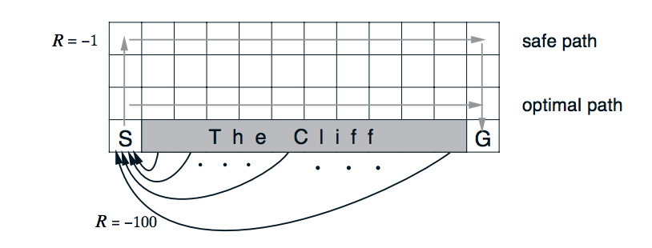

# Temporal Difference 
A Python Implementation for various Temporal Difference methods 

## Structure
* Temporal_Difference.ipynb - the corresponding solutions
* plot_utils.py - contains a plotting function for visualizing state-value functions and policies
* check_test.py - contains unit tests to check the validity of your implementations

## Project Environment 
0. Environment :  [CliffWalkingEnv](https://github.com/openai/gym/blob/master/gym/envs/toy_text/cliffwalking.py)
In this CliffWalking environment, the agent navigates a 4x12 gridworld.
```
    This is a simple implementation of the Gridworld Cliff
    reinforcement learning task.
    Adapted from Example 6.6 from Reinforcement Learning: An Introduction
    by Sutton and Barto:
    http://people.inf.elte.hu/lorincz/Files/RL_2006/SuttonBook.pdf
    With inspiration from:  https://github.com/dennybritz/reinforcement-learning/blob/master/lib/envs/cliff_walking.py
    The board is a 4x12 matrix, with (using Numpy matrix indexing):
        [3, 0] as the start at bottom-left
        [3, 11] as the goal at bottom-right
        [3, 1..10] as the cliff at bottom-center
    Each time step incurs -1 reward, and stepping into the cliff incurs -100 reward 
    and a reset to the start. An episode terminates when the agent reaches the goal.    
```

## Project Background
Temporal Difference(TD) is a combination of Monte Carlo and Dynamic Programming ideas. Like Monte Carlo, TD works based on samples and doesn't require a model of the environment. Like Dynamic Programming, TD uses bootstrapping to make updates. However, Monte Carlo (MC) prediction methods must wait until the end of an episode to update the value function estimate, whereas, temporal-difference (TD) methods update the value function after every time step.

> General Update Rule: Q[s,a] += learning_rate * (td_target - Q[s,a]). td_target - Q[s,a]

1. TD Control: Sarsa 
Sarsa(0) (or Sarsa) is an on-policy TD control method. It is guaranteed to converge to the optimal action-value function q∗, as long as the step-size parameter α is sufficiently small and ϵ is chosen to satisfy the Greedy in the Limit with Infinite Exploration (GLIE) conditions.
> TD Target for SARSA: R[t+1] + discount_factor * Q[next_state][next_action] 

2. TD Control: Q-learning
Sarsamax (or Q-Learning) is an off-policy TD control method. It is guaranteed to converge to the optimal action value function q∗, under the same conditions that guarantee convergence of the Sarsa control algorithm.
> TD Target for Q-Learning: R[t+1] + discount_factor * max(Q[next_state])

3. TD Control: Expected Sarsa
Expected Sarsa is an on-policy TD control method. It is guaranteed to converge to the optimal action value function q∗, under the same conditions that guarantee convergence of Sarsa and Sarsamax.

This algorithm has four arguments:

* env: This is an instance of an OpenAI Gym environment.
* num_episodes: This is the number of episodes that are generated through agent-environment interaction.
* alpha: This is the step-size parameter for the update step.
* gamma: This is the discount rate. It must be a value between 0 and 1, inclusive (default value: 1).

The algorithm returns as output:
* Q: This is a dictionary (of one-dimensional arrays) where Q[s][a] is the estimated action value corresponding to state s and action a.

## Analysis/Result
1. All of the TD control methods (Sarsa, Sarsamax, Expected Sarsa) converge to the optimal action-value function q∗ (and so yield the optimal policy π∗) if:
- the value of ϵ decays in accordance with the GLIE conditions, and
- the step-size parameter α is sufficiently small.
2. Sarsa and Expected Sarsa are both on-policy TD control algorithms. In this case, the same (ϵ-greedy) policy that is evaluated and improved is also used to select actions.
3. Q-Learning(Sarsamax) is an off-policy method, where the (greedy) policy that is evaluated and improved is different from the (ϵ-greedy) policy that is used to select actions.
4. On-policy TD control methods (like Expected Sarsa and Sarsa) have better online performance than off-policy TD control methods (like Q-learning aks Sarsamax).
5. Expected Sarsa generally achieves better performance than Sarsa.

|Cliff-walking task|result|
|--|--|
|||

* Q-learning achieves worse online performance (where the agent collects less reward on average in each episode), but learns the optimal policy, and
* Sarsa achieves better online performance, but learns a sub-optimal "safe" policy.
### Reference 
* [OpenAI Gym](https://github.com/openai/gym/blob/master/gym/envs/toy_text/cliffwalking.py)
* [Cliff Walking](https://github.com/dennybritz/reinforcement-learning/blob/master/lib/envs/cliff_walking.py)
* Richard & Barto's [Reinforcement Learning:An Introduction](https://web.stanford.edu/class/psych209/Readings/SuttonBartoIPRLBook2ndEd.pdf)
